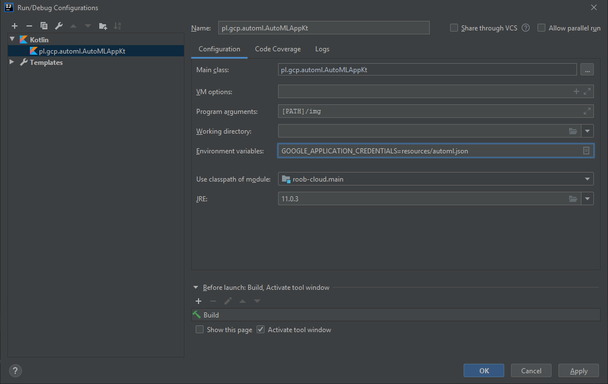

# GoogleCloudPlatform AutoML

[AutoML Vision] enables training machine learning models to classify images. 

## Prerequisites

You need to have [GCP SDK](https://cloud.google.com/sdk) installed.

## Setup

### Login into GCP

1. Log into your GCP:

```powershell
gcloud auth login
```

### Create and setup project (part 1)

2. [Create new project] and set is as current project: 

```console
gcloud projects create PROJECT_ID [--organization ORG_NAME]
gcloud config set project PROJECT_ID
```

Check project details:

```console
gcloud projects describe PROJECT_ID
```

3. [Create service account]: 

```console
gcloud iam service-accounts create SERVICE_ACCOUNT --display-name="ServiceAccount"
```

Notice that `SERVICE_ACCOUNT` is not an ID for account. ID is built based on `SERVICE_ACCOUNT` and `PROJECT_ID`, 
for example:

```console
gcloud projects create EXAMPLE_PROJECT
gcloud iam service-accounts create EXAMPLE_ACCOUNT 

# account id is:
set SERVICE_ACCOUNT_ID=EXAMPLE_ACCOUNT@EXAMPLE_PROJECT.iam.gserviceaccount.com
```

4. [Add permissions]:

```console
gcloud projects add-iam-policy-binding PROJECT_ID --member="serviceAccount:SERVICE_ACCOUNT_ID" \ 
    --role "roles/automl.editor"
```

5. [Create key for user]:

Before we create key, lets check what we have:

```console
gcloud iam service-accounts keys list --iam-account=SERVICE_ACCOUNT_ID

# output
KEY_ID                                    CREATED_AT            EXPIRES_AT
SOME_KEY_ID_f7dacee50f5607beb0020d782e21  2020-03-03T10:36:03Z  2022-03-27T23:59:24Z
```

Lets create new key for `service account`:

```console
gcloud iam service-accounts keys create OUTPUT_JSON_FILE --iam-account=SERVICE_ACCOUNT_ID
```

Notice this key should remain private, so do not push it to git, etc. 

### Create storage for images to train

6. Check your [billing accounts]:

```console
gcloud beta billing accounts list

# Example output
ACCOUNT_ID            NAME                OPEN  MASTER_ACCOUNT_ID
SOMEID-B3F4EE-AA567B  My Billing Account  True
```

7. [Connect project with your billing account]:

```console
gcloud beta billing projects link PROJECT_ID  --billing-account=ACCOUNT_ID
```

8. Create google storage bucket (at least for now it must be `us-central1`)

```console
gsutil mb -p PROJECT_ID -c regional -l us-central1 gs://PROJECT_ID-vcm/
```

9. Copy dataset into storage bucket:

In this step we copy example dataset from google storage bucket, but we can prepare own dataset as well:

```console
gsutil -m cp -R gs://cloud-ml-data/img/flower_photos/ gs://PROJECT_ID-vcm/img/
``` 

10. Prepare csv file for training process:

```console
gsutil cat gs://PROJECT_ID-vcm/img/flower_photos/all_data.csv | sed "s:cloud-ml-data:PROJECT_ID-vcm:" \ 
    > all_data.csv
gsutil cp all_data.csv gs://PROJECT_ID-vcm/csv/
```

Proper format is as follows:

```csv
gs://PROJECT_ID-vcm/img/flower_photos/daisy/100080576_f52e8ee070_n.jpg,daisy
gs://PROJECT_ID-vcm/img/flower_photos/daisy/10140303196_b88d3d6cec.jpg,daisy
gs://PROJECT_ID-vcm/img/flower_photos/daisy/10172379554_b296050f82_n.jpg,daisy
...
```

### Setup project (part 2)

11. [Enable api] for  `AutoML`:

```console
gcloud services enable "automl.googleapis.com"
```

12. [Create dataset] for `AutoML`
13. [Train model] (for practice purpose set `maximum node hours` to minimum value - thanks to that we avoid high bill)

## Test AutoML

1. [Deploy model]
2. Configure credentials:

To run prediction you need to configure google credentials: 

```console
set GOOGLE_APPLICATION_CREDENTIALS=SOME_PATH/OUTPUT_JSON_FILE
```

This is required step to run prediction. 

3. Make a prediction

Run `AutoMLApp`:




3. [Undeploy model]
4. Remove Google Storage Bucket

```console
gsutil rm -r gs://PROJECT_ID-vcm/
``` 

## Read more

[Read more](https://cloud.google.com/sdk/gcloud/reference) about `gcloud SDK`.

[Read more](https://cloud.google.com/storage/docs/gsutil) about `gsutil SDK`.


[AutoML Vision]: https://cloud.google.com/automl
[Create new project]: https://cloud.google.com/resource-manager/docs/creating-managing-projects 
[Create service account]: https://cloud.google.com/sdk/gcloud/reference/iam/service-accounts/create
[Add permissions]: https://cloud.google.com/sdk/gcloud/reference/iam/service-accounts/add-iam-policy-binding
[Create key for user]: https://cloud.google.com/sdk/gcloud/reference/iam/service-accounts/keys/create
[billing accounts]: (https://cloud.google.com/sdk/gcloud/reference/beta/billing/accounts)
[Connect project with your billing account]: (https://cloud.google.com/sdk/gcloud/reference/beta/billing/projects/link):
[Enable api]: https://cloud.google.com/endpoints/docs/openapi/enable-api
[Create dataset]: https://cloud.google.com/vision/automl/docs/quickstart#create_your_dataset
[Train model]: https://cloud.google.com/vision/automl/docs/quickstart#train_your_model
[Deploy model]: https://cloud.google.com/vision/automl/docs/quickstart#manually-deploy-model
[Undeploy model]: https://cloud.google.com/vision/automl/docs/quickstart#undeploy-your-model
